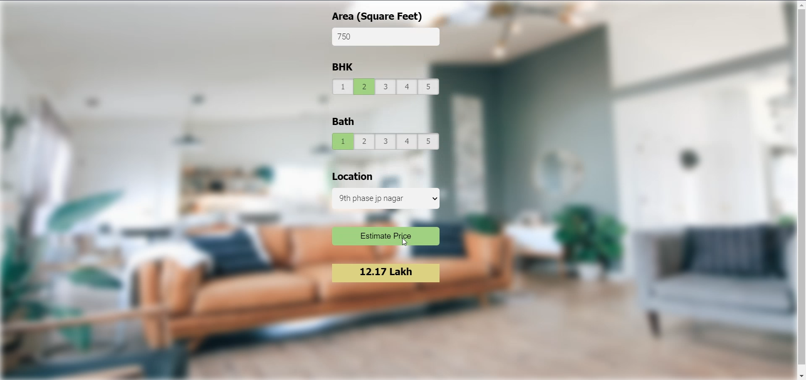

# REAL-ESTATE-PRICE-PREDICTION
REAL ESTATE PRICE PREDICTION Using Python &amp; Bengaluru_House_Data.

#### This data science project walks through step by step process of how to build a real estate price prediction model. We will build a model using sklearn and linear regression using banglore home prices dataset from kaggle.com.
#### During model building we have covered almost all data science concepts such as data load and cleaning, outlier detection and removal, feature engineering, dimensionality reduction, gridsearchcv for hyperparameter tunning, k fold cross validation etc. Technology and tools wise this project covers,
1. Python
2. Numpy and Pandas for data cleaning
3. Matplotlib for data visualization
4. Sklearn for model building
5. Jupyter notebook as IDE

* All the steps required to execute the project have been mentioned in the .ipynb file.

### This is how the Final Result will look like.

### CREDITS
Special thanks to Dhaval Patel for the guidance through youtube tutorials.
